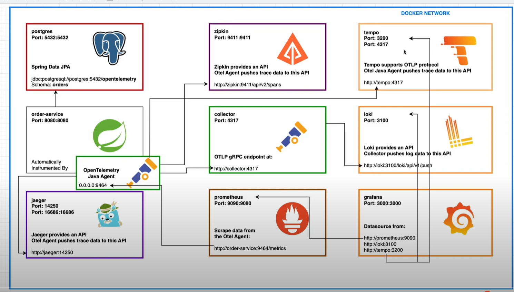
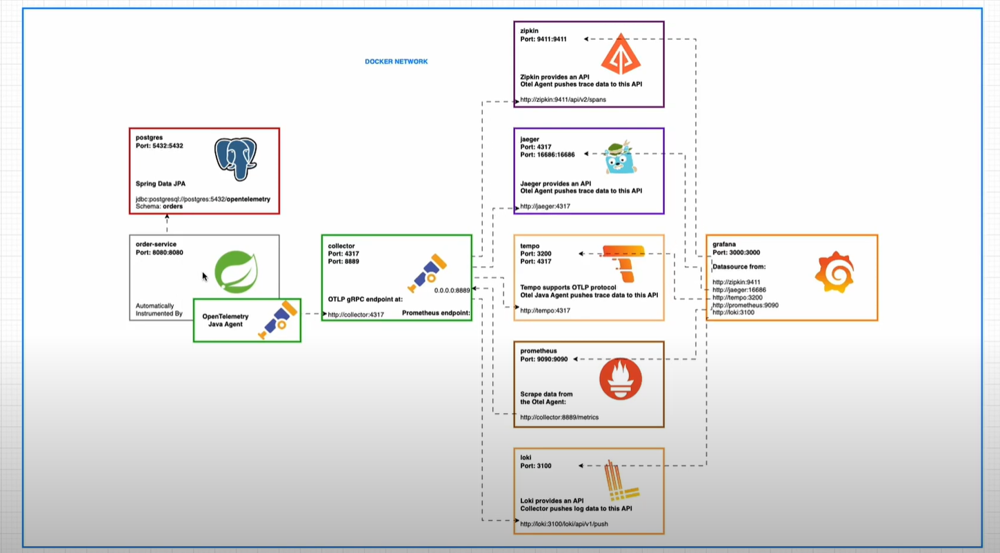
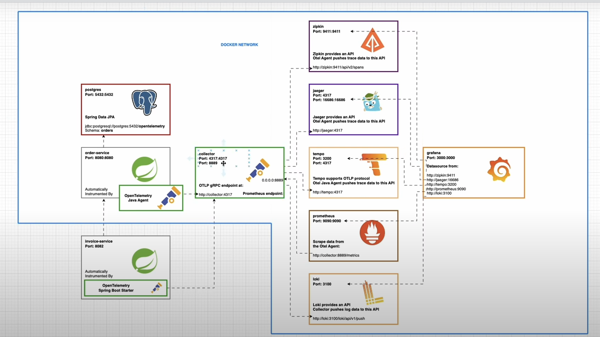

# OpenTelemetry

## 1 Automatically Instrument Spring Boot App by OpenTelemetry Java Agent

### Download the opentelemetry java agent 

    curl -L -O https://github.com/open-telemetry/opentelemetry-java-instrumentation/releases/download/v1.32.0/opentelemetry-javaagent.jar

Using java agent opentelemetry version 2 does not work the same way but this is just a good example showing how observability can
be implemented

### Run the jar file with the java agent

    java -javaagent:opentelemetry-javaagent.jar -Dotel.traces.exporter=logging -Dotel.metrics.exporter=logging -Dotel.logs.exporter=logging -jar target/open-telemetry-0.0.1-SNAPSHOT.jar

If you don't specify the options opentelemetry will continue raise exceptions because it does not find a collector on port 4318

## 2 PostgresSql -- Spring Boot + OpenTelemetry Java agent

## 3 OpenTelemetry (traces): Spring Boot 3 + OpenTelemetry Java Agent -- Zipkin

## 4 OpenTelemetry (metrics): Spring Boot 3 + OpenTelemetry Java Agent -- Prometheus -- Grafana

Once you run grafana you have to log in
 * username: admin
 * password: admin

Then it will ask you to change the password.

Then you can import a grafana dashboard from a template for example **https://grafana.com/grafana/dashboards/18812-jvm-overview-opentelemetry/**

## 5 Spring Boot 3 + OpenTelemetry Java Agent — Otel Collector — Loki

Java Opentelemtry agent does not support loki so we have to install an otel collector as well. Installing a Collector
is also really important because it will fetch opentelemetry metrics for all applications.

## 6 Observability Coordinated: Prometheus Exemplars (Metrics) — Grafana Tempo (Traces) — Loki (Logs)

Now let's make some consideration about prometheus metric **http_server_duration_milliseconds_bucket**

### WHat is Exemplars
[Exemplars](https://grafana.com/docs/grafana/latest/fundamentals/exemplars/#:~:text=An%20exemplar%20is%20a%20specific%20trace%20representative%20of,exemplars%20are%20a%20way%20to%20link%20the%20two): 

    An exemplar is a specific trace representative of measurement taken in a given time interval. 
    While metrics excel at giving you an aggregated view of your system, traces give you a fine grained view of a single 
    request; exemplars are a way to link the two.

A concrete example from grafana documentation:

Suppose your company website is experiencing a surge in traffic volumes. While more than eighty percent of the users are able to access the website in under two seconds, some users are experiencing a higher than normal response time resulting in bad user experience.

To identify the factors that are contributing to the latency, you must compare a trace for a fast response against a trace for a slow response. Given the vast amount of data in a typical production environment, it will be extremely laborious and time-consuming effort.

Use exemplars to help isolate problems within your data distribution by pinpointing query traces exhibiting high latency within a time interval. Once you localize the latency problem to a few exemplar traces, you can combine it with additional system based information or 
location properties to perform a root cause analysis faster, leading to quick resolutions to performance issues.

Support for exemplars is available for the Prometheus data source only. Once you enable the functionality, exemplar data is available by default. 

### How to support exemplars in grafana and tempo
Now go to grafana UI

 * Add Tempo Datasource
 * Data Sources/Prometheus/Exemplars/ `{ "internal link": true, "data source": tempo, "label name": trace_id }`
 * Go to Explore Prometheus and query the metric http_server_duration_milliseconds_bucket
 * Then edit the panel below and set exemplars true
 * You will see that some **PinPoints** are added to your graph. If you hover one of them a model appears where the button `query with tempo`
 * Click it and you will get the whole tempo span of that exemplars

So right now we have some metrics that are correlated with some traces. Let's see how to correlate traces with logs

 * Go to Tempo Data Source/ Trace to logs `{"Data source": loki, "Span start time shift": -1h, "Span end time shift": 1h, "Filter by trace id": true, "Filter by span id": false", "Tags": ["service.name": "job"]}`
 * Remember the Tags part really important to map labels from tempo to labels from loki
 * Go to Explore/Tempo Make a query with Service Name equals Order-service 
 * Click on a Trace id link
 * Near each span you will find a log link. If you click it, the logs from loki will appear

So in the end you can explore prometheus, query the  **http_server_duration_milliseconds_bucket** with exemplars.
Each exemplars have a **Query with tempo** button and for each trace in Tempo you have the grafana loki logs. So we connect
all together. This is the manual procedure to understand what is the goal. Of course we can configure it in the grafana datasource

## 7. OpenTelemetry (traces): Spring Boot 3 + Java Agent — Otel Collector — Jaeger — Zipkin — Tempo
## 8. OpenTelemetry (metrics): Spring Boot 3 + Java Agent — Collector — Prometheus Exemplars — Grafana

### 7 
Placing the collector before. The 7th will involve the tracing and the 8th the metrics.
This way we can take advantages of the otel collector retry batching...

Adding batching feature in collector is really important especially in production. The following is an example on how a collector
can be fully configured

[data_dog_exporter](https://github.com/open-telemetry/opentelemetry-collector-contrib/blob/main/exporter/datadogexporter/examples/collector.yaml)

In grafana now we could try to add jaeger as datasource, and we can do it, but then we cannot link it to grafana loki because
we miss the tags part we make when configuring tempo `"Tags": ["service.name": "job"]`.

So we need to **TAG** our traces. To do this in our opentelemetry agent we add OTEL_RESOURCE_ATTRIBUTES. For now we can limit
our attributes to the service and the environment but in production they can be much more. 

After doing that we can map the tags, for example if we have set those attributes `service=order-service,env=dev`; we can 
have something like this `"Tags": ["service.name": "job"]`. And now we have the same behaviour then in tempo, so we can see
the logs from grafana loki related to that traceId.

The exact same thoughts goes for zipkin.

### 8

Once you put prometheus after the collector some name changes and you won't find **http_server_duration_milliseconds_bucket** anymore
immediately because there is the batch from the collector. 

If you enable Prometheus Remote Write as exporter in collector you don't need to enable scrape anymore. Collector will push everything
automatically to prometheus

## 9. OpenTelemetry x GraalVM Native Image: Automatically Instrument by Otel Spring Boot Starter

