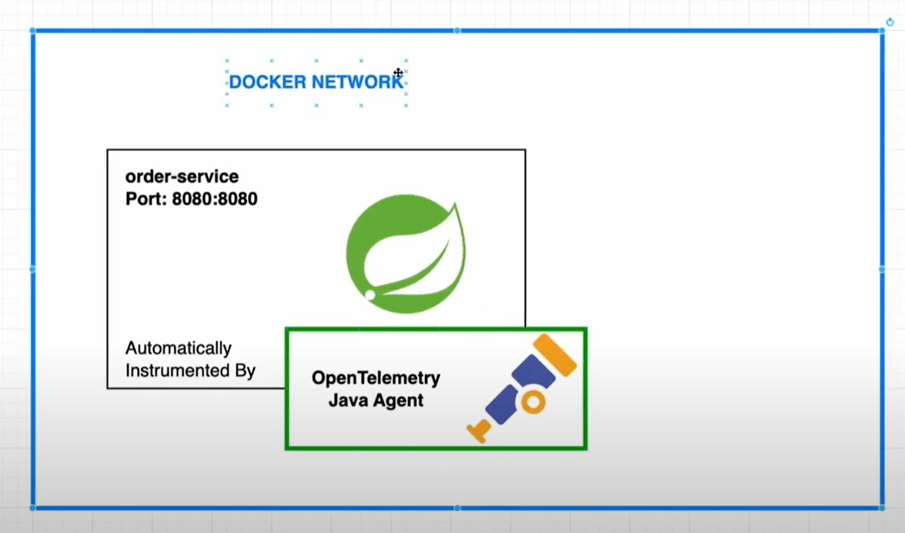
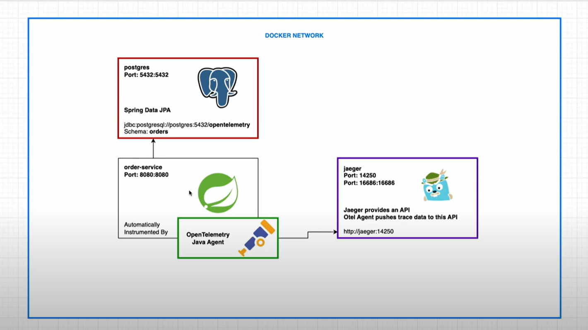
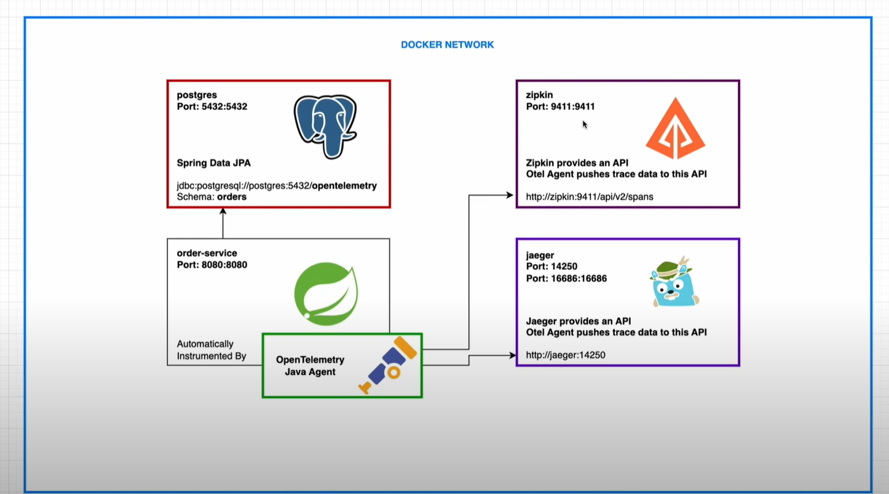
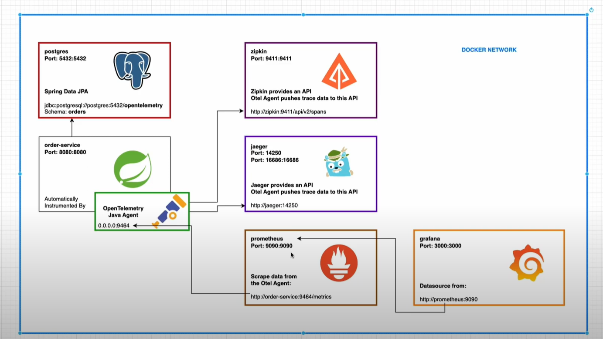
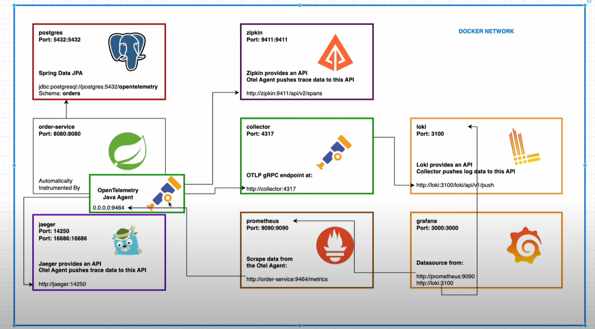

# OpenTelemetry

## 1 Automatically Instrument Spring Boot App by OpenTelemetry Java Agent

### Download the opentelemetry java agent 

    curl -L -O https://github.com/open-telemetry/opentelemetry-java-instrumentation/releases/download/v1.32.0/opentelemetry-javaagent.jar

Using java agent opentelemetry version 2 does not work the same way but this is just a good example showing how observability can
be implemented

### Run the jar file with the java agent

    java -javaagent:opentelemetry-javaagent.jar -Dotel.traces.exporter=logging -Dotel.metrics.exporter=logging -Dotel.logs.exporter=logging -jar target/open-telemetry-0.0.1-SNAPSHOT.jar

If you don't specify the options opentelemetry will continue raise exceptions because it does not find a collector on port 4318

## 2 PostgresSql -- Spring Boot + OpenTelemetry Java agent

## 3 OpenTelemetry (traces): Spring Boot 3 + OpenTelemetry Java Agent -- Zipkin

## 4 OpenTelemetry (metrics): Spring Boot 3 + OpenTelemetry Java Agent -- Prometheus -- Grafana

Once you run grafana you have to log in
 * username: admin
 * password: admin

Then it will ask you to change the password.

Then you can import a grafana dashboard from a template for example **https://grafana.com/grafana/dashboards/18812-jvm-overview-opentelemetry/**

## 5 Spring Boot 3 + OpenTelemetry Java Agent — Otel Collector — Loki

Java Opentelemtry agent does not support loki so we have to install an otel collector as well. Installing a Collector
is also really important because it will fetch opentelemetry metrics for all applications.
