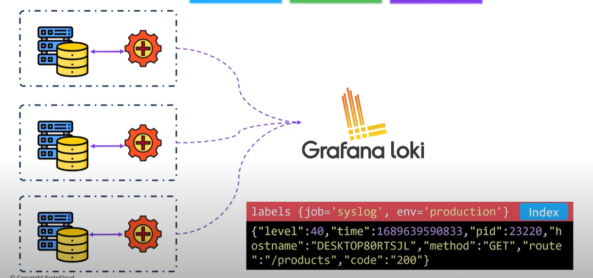

# Loki Configuration and Integration

## What is Loki

 * Loki is a log aggregation system designed to store and query logs. Designed to be cost effective and easy to operate. 
 * Loki does not index full text from logs (like Elasticsearch), loki only indexes labels (metadata)

## Loki Architecture

AS always in order to collect logs from your system you need to instrument your application. For example you can use promtail.

Promtail is going to collect logs from your applications and forward them to loki. 

To store the log messages you can choose between different options. You can choose for example the local filesystem or an s3
standard

To interact with Loki we can use something called LogQL. And you can easily connect Grafana to loki so you can have a nice GUI